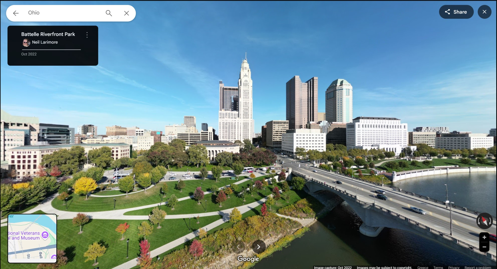

# Beauty
## category: OSINT ("Ohio")
## author: segal

## Description
truly a beautiful panorama. ohio is not always ugly. i really wanna know who made this pano tho. what's their name?

flag will look like: UMDCTF{Darryll Pines}

## Attachments
-> One .jpg image: `beauty.jpg` 

## Solution

By running any of those buildings through a reverse image lookup tool, we figure out quite fast that we are in Colombus, Ohio.
By browsing around in a map, we get a rough idea of where we are. Using google street view, we can get the exact position, form which the panorama was taken!

In the top left, the name of the photographer is displayed!

Last step, formatting the flag:

## Flag
`UMDCTF{Neil Larimore}`
