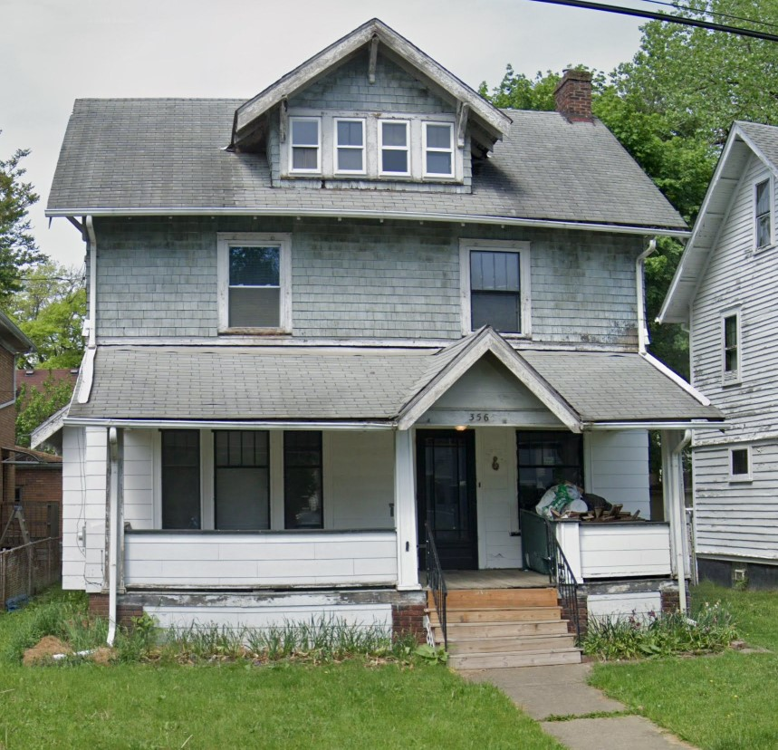
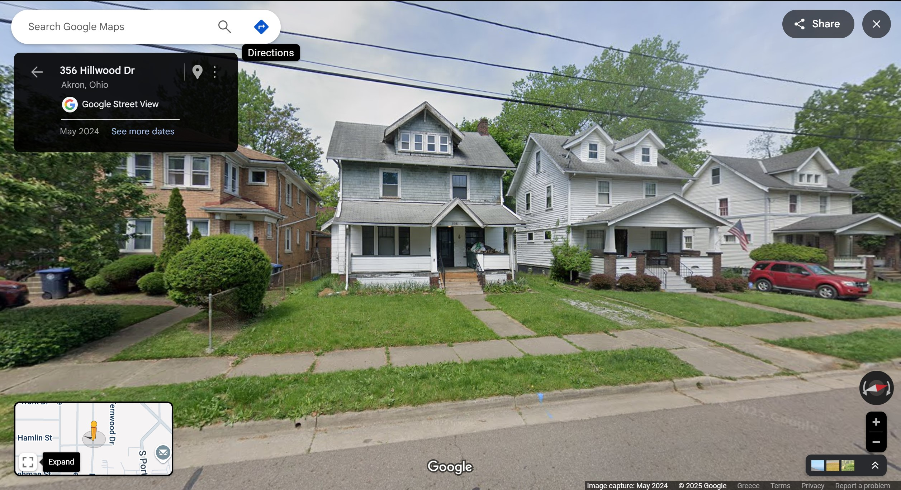

# Sunshine
## category: OSINT ("Ohio")
## author: segal

## Description
what a nice sunny day. what is the full address of house number 356?

flag will look like: UMDCTF{3983 Campus Dr, College Park, MD 20742}

## Attachments
-> One .jpg image: `sunshine.jpg` 

## Solution

Image seems to be a picture of a neighbourhood. On the left side, we can see the house numbered `356` just as mentioned in the description.

Yet again, the answer is to screenshot the house of interest and upload it to the reverse image lookup tool of your liking. Most hits will have a headline similar to "Le Bron James' childhood house". Knowing that, looking up "Le Bron James childhood house" and clicking around, we find the address.

Now, getting the flag is purely a matter of formatting.

## Flag
`UMDCTF{356 Hillwood Dr, Akron, OH 44320}`