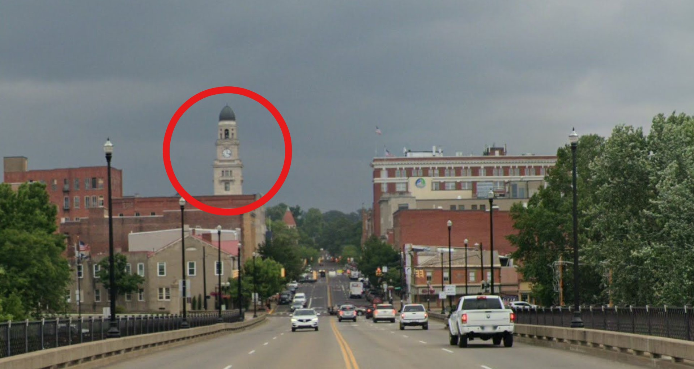

# SWAG-LIKE-OHIO
## category: OSINT ("Ohio")
## author: segal

## Description
swag like ohio. down in ohio. swag like ohio. down in ohio. anyway we seem to be on a bridge. what's the address of the bridge?

flag will look like: `UMDCTF{Boulder Bridge, Washington, DC 20008}`

## Attachments
-> One .jpg image: `swag-like-ohio.jpg`

## Solution
Zooming into the center of the image reveals building structures. A clock tower stands out.

Using a reverse image lookup tool immediatly reveals more images of the tower. Among the headlines there are many along the lines of "Clock Tower in Marietta Ohio"

Looking up "Marietta Ohio" via a map application (i.e. "Google Maps"); using the street view feature on the only available bridge within the Marietta perimeter, we get the exact same point of view as the picture!

Getting the flag is just a matter of formatting the figured out location.

## Flag
`UMDCTF{Putnam Bridge, Marietta, OH 45750}`