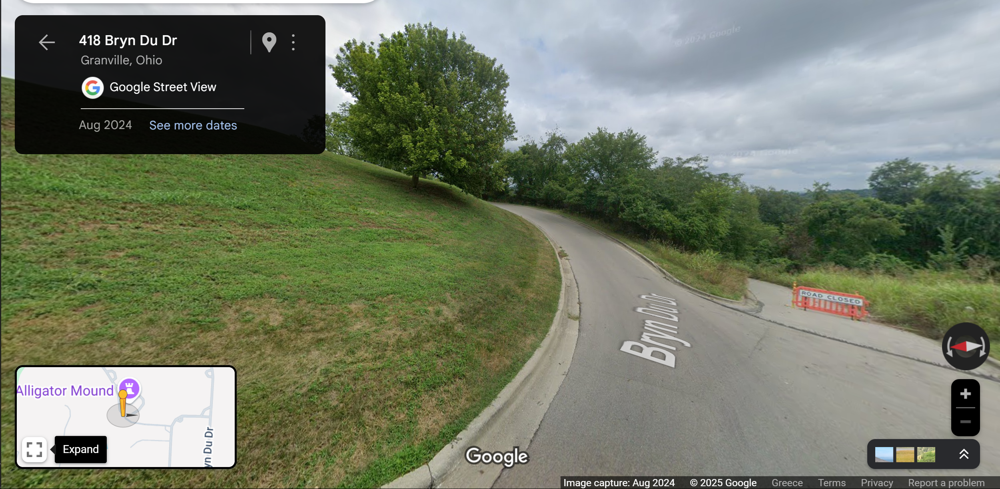

# The Blueprint
## category: OSINT ("Ohio")
## author: segal

## Description
always respect the blueprint (she's never coming back lil bro (i am heartbroken)). anyways, what street are we on?

flag will look like: UMDCTF{Campus Dr, College Park, MD 20742}

## Attachments
-> One .jpg image: `the-blueprint.jpg` 

## Solution

Because the image has a weird look (probably a 360 degrees camera edited into a flat image), many parts (mainly bottom and top) seem distorted. The only parts which seem untouched is the center. Uploading the center of the image (including most of the tree, the street and the connection point of the pavement with the grass) to a reverse image lookup tool reveals yet again the correct location!

Now, getting the flag is purely a matter of formatting.

## Flag
`UMDCTF{Bryn Du Dr, Granville, OH 43023}`